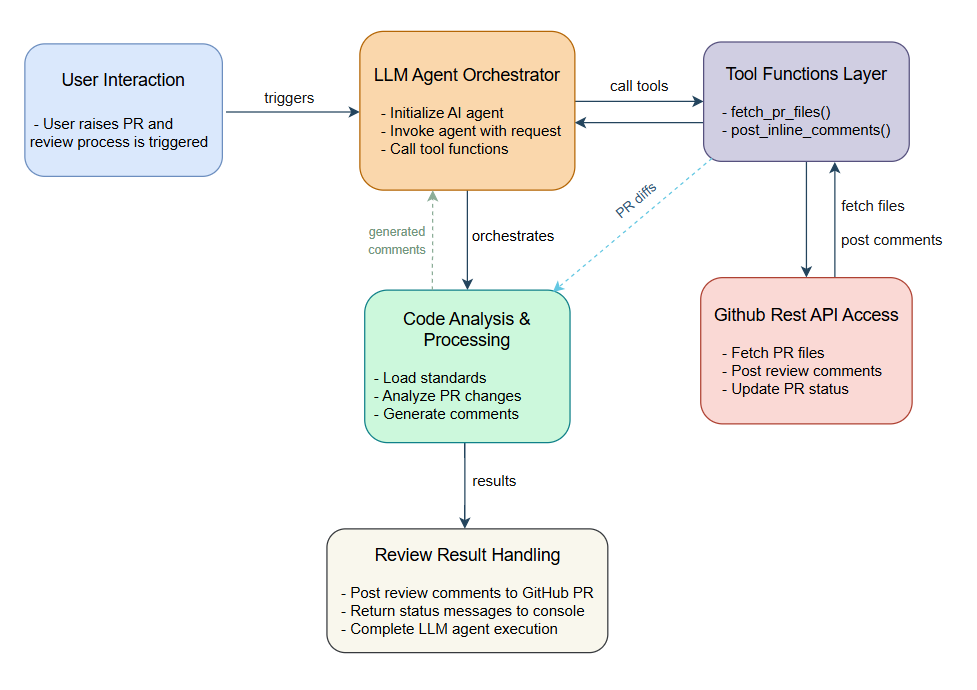

# 🧠 ReviewPal: AI-powered Pull Request Review Agent

> Automatically review GitHub Pull Requests with standard-compliant inline comments — powered by Gemini + LangGraph.

## 📌 Features

- ✅ AI-based automated code review for GitHub Pull Requests
- 🎯 Adds inline comments strictly on newly added lines only
- 📐 Fully standards-compliant reviews — supports any language/codebase (standards are configurable)
- 🔧 Modular LangChain tools to fetch diffs and post suggestions
- 🤖 Uses Gemini (via langchain-google-genai) and LangGraph's ReAct-style agent
- 🧪 Minimal setup and fully environment-driven configuration

## 🧱 Architecture



The architecture consists of six layers:

- **User Interaction**: Initiates review via CLI or automation, provides PR details
- **LLM Agent Orchestrator**: LangGraph-powered Gemini agent that manages tool calling and flow control
- **Tool Functions Layer**: Wraps GitHub tools like fetch_pr_files() and post_inline_comments() as LangChain tools
- **GitHub REST API Access**: Handles actual HTTP operations to fetch file diffs and post reviews
- **Code Analysis & Processing**: Loads code standards, analyzes diffs, and generates suggestions
- **Review Result Dispatcher**: Final step to post comments and optionally notify the user

## 🚀 Getting Started

### 1\. Clone the repository

```
git clone https://github.com//ReviewPal.git  cd ReviewPal
```

### 2\. Install dependencies

```
pip install -r requirements.txt
```

### 3\. Set up environment variables

Create a .env file with the following keys:

```
 GEMINI_API_KEY=your_gemini_api_key
 TOKEN_GITHUB=your_github_pat
 GITHUB_REPO=username/repo-name
 PR_NUMBER=your_pull_request_number
```

## 🧪 Usage

To run the review agent:

```
python review_agent.py
```

This will:

- Fetch the PR diff
- Analyze the code using AI based on your provided standards
- Post inline review comments directly on GitHub

## 📌 Technologies Used

- LangGraph
- LangChain
- [Gemini (Google Generative AI)](https://ai.google.dev/)
- [httpx](https://www.python-httpx.org/)
- Python 3.10+

## 🔮 Future Scope

- Support for multiple cooperating agents (e.g., security reviewer, style reviewer, performance reviewer)
- Integration with an MCP (Multi-Context Processor) Server for:

  - Contextual codebase awareness
  - Database/stateful session memory
  - Connecting PRs to JIRA and validating against acceptance criteria
